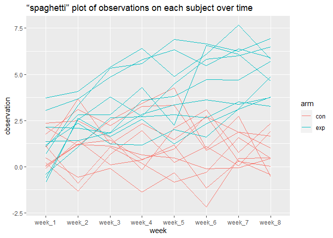

p8105\_hw5\_xz3078
================

## Problem 1

``` r
homicide_df = 
  read_csv("./homicide-data.csv", na = c("", "Unknown")) %>%
  mutate(
    city_state = str_c(city, state),
    resolution = case_when(
      disposition == "Closed without arrest" ~ "unsolved", 
      disposition == "Open/No arrest" ~ "unsolved",
      disposition == "Closed by arrest" ~ "solved"
    )
  ) %>%
  relocate(city_state) %>%
  filter(city_state != "TulsaAL")
```

    ## Rows: 52179 Columns: 12

    ## -- Column specification --------------------------------------------------------
    ## Delimiter: ","
    ## chr (8): uid, victim_last, victim_first, victim_race, victim_sex, city, stat...
    ## dbl (4): reported_date, victim_age, lat, lon

    ## 
    ## i Use `spec()` to retrieve the full column specification for this data.
    ## i Specify the column types or set `show_col_types = FALSE` to quiet this message.

``` r
baltimore_df = 
  homicide_df %>%
  filter(city_state == "BaltimoreMD")

baltimore_summary = 
  baltimore_df %>%
  summarize(
    unsolved = sum(resolution == "unsolved"),
    n = n()
  )

baltimore_test = 
  prop.test(
    x = baltimore_summary %>% pull(unsolved),
    n = baltimore_summary %>% pull(n)
  )

baltimore_test %>%
  broom::tidy()
```

    ## # A tibble: 1 x 8
    ##   estimate statistic  p.value parameter conf.low conf.high method    alternative
    ##      <dbl>     <dbl>    <dbl>     <int>    <dbl>     <dbl> <chr>     <chr>      
    ## 1    0.646      239. 6.46e-54         1    0.628     0.663 1-sample~ two.sided

``` r
results_df = homicide_df %>%
  group_by(city_state) %>%
  summarize(
    unsolved = sum(resolution == "unsolved"),
    n = n()
  ) %>%
  mutate(
    test_results = map2(unsolved, n, prop.test),
    tidy_results = map(test_results, broom::tidy)
  ) %>%
  select(city_state, tidy_results) %>%
  unnest(tidy_results) %>%
  select(city_state, estimate, starts_with("conf"))
```

``` r
results_df %>%
  mutate(city_state = fct_reorder(city_state, estimate)) %>%
  ggplot(aes(x = city_state, y = estimate)) +
  geom_point() +
  geom_errorbar(aes(ymin = conf.low, ymax = conf.high)) +
  theme(axis.text.x = element_text(angle = 90, vjust = 0.5, hjust = 1))
```

<!-- -->

## Problem 2

``` r
file_name = tibble(files = list.files("./data/"))

read_file_f = function(x) {
  read.csv(file = str_c("./data/", x))
}

file = list.files("./data/")
output = map(file, read_file_f)

values = output %>% 
  bind_rows()

data = tibble(file_name, values) %>% 
  separate(files, into = c("arm", "id"), sep = "\\_") %>%
  mutate(id = str_replace(id, "\\.csv", ""),
         id = as.numeric(id)) %>%
  pivot_longer(
    week_1:week_8,
    names_to = "week", 
    values_to = "observation"
  ) %>%
  mutate(arm_id = str_c(arm, id)) %>%
  select(arm_id, everything())

data %>% 
  group_by(arm_id) %>%
  ggplot(aes(x = week, y = observation, color = arm_id)) + 
    geom_point(alpha = .5) + 
    geom_line()
```

    ## geom_path: Each group consists of only one observation. Do you need to adjust
    ## the group aesthetic?

<!-- -->

``` r
    labs(title = "“spaghetti” plot of average value over time",
         y = "mean value")
```

    ## $y
    ## [1] "mean value"
    ## 
    ## $title
    ## [1] "“spaghetti” plot of average value over time"
    ## 
    ## attr(,"class")
    ## [1] "labels"

## Problem 3

``` r
set.seed(10)

iris_with_missing = iris %>% 
  map_df(~replace(.x, sample(1:150, 20), NA)) %>%
  mutate(Species = as.character(Species))
```
